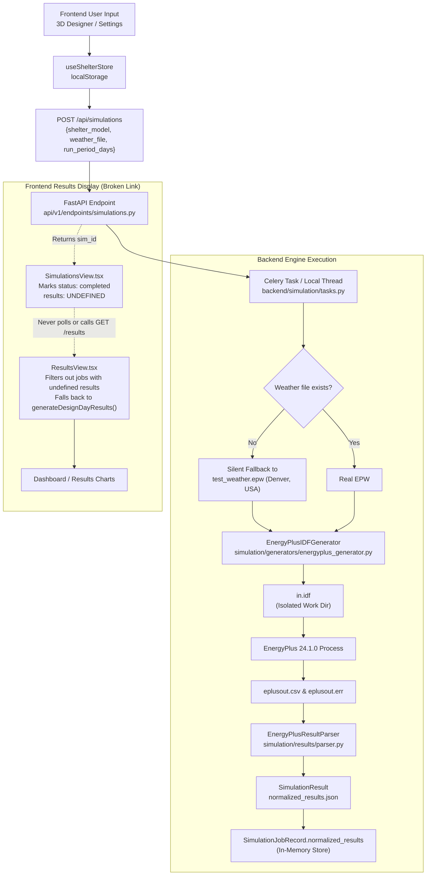
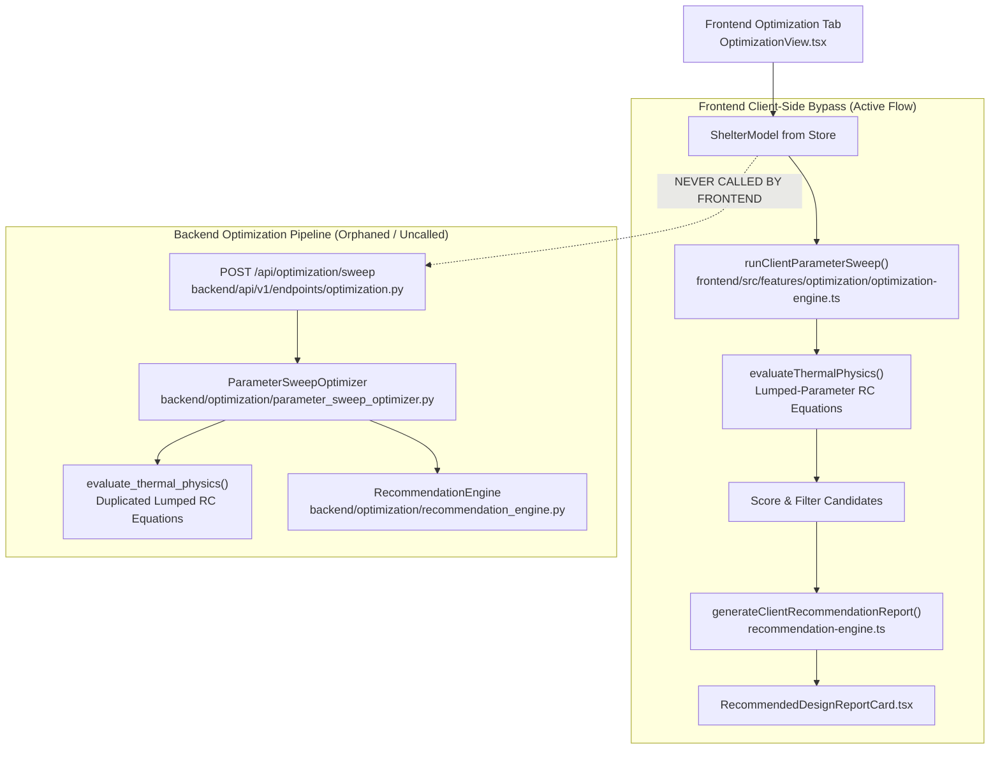
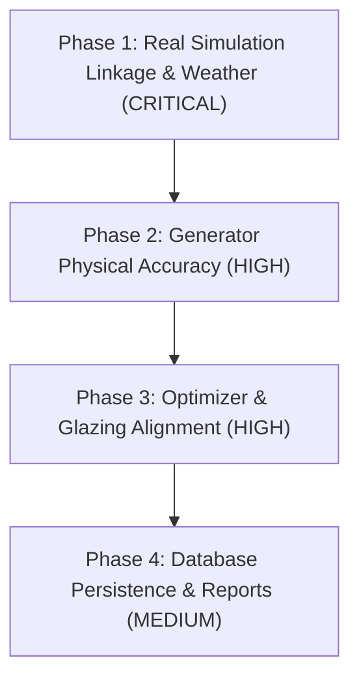

# Engineering Audit & Technical Verification: Remaining Work Audit
**Project:** SIH 2026 Problem Statement 26051 (Area-Specific Thermal Simulation Platform for High-Altitude Shelters)  
**Document ID:** `docs/REMAINING_WORK_AUDIT.md`  
**Date:** September 2026  
**Status:** Audit Complete — No Logic Modifications Made Yet

---

## 1. Executive Summary

This code-level technical audit evaluates the current end-to-end implementation of the SIH 2026 PS 26051 shelter thermal simulation application. The purpose of this audit is to transition the application from an impressive architectural prototype to an engineering-trustworthy, technically correct, and physically validated system suitable for rigorous evaluation by DRDO, ISHRAE, and building physics domain specialists.

### Core Architecture Findings

1. **Flow 1 (Simulation Pipeline):** The 3D geometry engine, multi-layer wall conduction transfer functions, and window/door coordinates are successfully implemented and passed to EnergyPlus. However, the simulation loop is partially decoupled at runtime:
   - The frontend (`SimulationsView.tsx`) queues the job via `POST /api/simulations`, but immediately marks the local state as `completed` without polling or fetching the backend normalized results (`GET /api/simulations/{id}/results`).
   - The frontend displays pre-packaged synthetic results (`generateDesignDayResults()`) rather than live simulation output.
   - The backend silently falls back to `simulation/weather/test_weather.epw` (which is actually a **Denver, Colorado, TMY3 weather file at 1829m**, not Leh/Ladakh at 3500m) because no Leh EPW file exists in the repository.
   - Internal thermal mass material and thickness, infiltration (0.5 ACH), and timestep (4/hr) are hardcoded in the IDF generator, completely ignoring user inputs.
   - Mechanical/natural ventilation and internal sensible gains (occupants, lighting, equipment) are completely omitted from the generated IDF.
2. **Flow 2 (Optimization & Recommendation Pipeline):**
   - The frontend implements a client-side TypeScript copy (`optimization-engine.ts`) of the optimization logic and executes it entirely in the browser, completely bypassing the backend `/api/optimization/sweep` endpoint.
   - Neither the frontend nor the backend optimizer runs EnergyPlus. Both evaluate candidate designs using a simplified lumped-capacitance RC heat-balance equation with hardcoded ambient temperatures (-18°C night, -11°C mean, -4°C noon) and hardcoded 5200 HDD18.
   - Material thermophysical properties (conductivity, density, specific heat) and glazing parameters (SHGC, U-factor) are duplicated across three different files with conflicting numerical values (up to 35% discrepancy).
3. **Database & Persistence:**
   - The SQLAlchemy models (`Material`, `Construction`, `ShelterModelEntity`, `SimulationRun`) and repository classes exist, but are completely unused by the active API endpoints.
   - Active API endpoints either serve in-memory state (`simulation_store`, `_OPTIMIZATION_RUNS`) or static hardcoded lists (`AVAILABLE_WEATHER_SOURCES`). All runtime state is lost on backend process restart.

---

## 2. End-to-End Parameter Classification Table

Every major engineering parameter is classified into one of eight categories:
- **A**: Correctly connected end-to-end
- **B**: Connected but simplified
- **C**: Hard-coded
- **D**: Dummy/demo
- **E**: Fallback
- **F**: Ignored
- **G**: Incorrectly mapped
- **H**: Missing

| # | Parameter | Classification | Flow 1 Status | Flow 2 Status | Notes / Location |
|---|---|:---:|---|---|---|
| 1 | **location** (region / name) | **B** | Connected to IDF `Site:Location` | Passed to report metadata | Sanitized string; no geocoding |
| 2 | **latitude** | **B** | Sent to IDF `Site:Location` | Ignored | Conflicts with EPW latitude (Denver 39.74°N) |
| 3 | **longitude** | **B** | Sent to IDF `Site:Location` | Ignored | Timezone hardcoded to 5.5 in IDF |
| 4 | **elevation** | **B** | Sent to IDF `Site:Location` | Hardcoded 3500m assumed | Overridden by EPW hourly pressure |
| 5 | **weather source** (identifier) | **E** | Name displayed in UI | Static string | EPW filename passed in payload |
| 6 | **weather file** (physical EPW) | **E / D** | Silent fallback to `test_weather.epw` | Denver EPW data used | Missing authentic Leh EPW file |
| 7 | **simulation period** (days/dates) | **B** | `run_period_days` sent; dates default | Fixed 3-day design period | `startMonth`/`startDay` not sent from frontend |
| 8 | **timestep** | **C** | Hardcoded to 4 in IDF line 266 | Assumed 1 hr | Frontend `timestepsPerHour` ignored |
| 9 | **length** | **A** | Correctly generates 3D geometry | Scales floor area & volume | Full vertex coordinate derivation |
| 10 | **width** | **A** | Correctly generates 3D geometry | Scales floor area & volume | Full vertex coordinate derivation |
| 11 | **height** | **A** | Correctly generates 3D geometry | Scales wall area & volume | Full vertex coordinate derivation |
| 12 | **shape** | **B** | Only Rectangle implemented | Assumes rectangular box | L/T/U shapes not supported |
| 13 | **roof** (type & pitch) | **A** | Generates Flat, Shed, Gable vertices | Assumes flat or 15° pitch | Correct 3D surface vertices |
| 14 | **orientation** | **G** | Mapped to `Building` North Axis | Cosine efficiency factor | Convention ambiguity: South solar vs North |
| 15 | **north wall** (assembly) | **A** | Generates outside-to-inside layers | Evaluates composite U-value | 1D transient CTF simulation |
| 16 | **south wall** (assembly) | **A** | Generates outside-to-inside layers | Evaluates composite U-value | Host wall for solar apertures |
| 17 | **east wall** (assembly) | **A** | Generates outside-to-inside layers | Evaluates composite U-value | Conduction calculated per orientation |
| 18 | **west wall** (assembly) | **A** | Generates outside-to-inside layers | Evaluates composite U-value | Conduction calculated per orientation |
| 19 | **roof construction** | **B** | Layers generated in IDF | Evaluates U-value | Overhang & solar absorptance ignored |
| 20 | **floor construction** | **B** | Layers generated in IDF | Hardcoded ground U=0.28 | Ground temp hardcoded; perimeter flag ignored |
| 21 | **multilayer materials** | **A** | EnergyPlus Material/Construction objects | Layer resistance summation | Fully sequential layer order |
| 22 | **material properties** | **A / B** | Looked up in `material_db` | Looked up in local dict | Discrepancy between store and optimizer |
| 23 | **windows** (position & size) | **A** | Modeled in `FenestrationSurface:Detailed` | Sweeps total window area | Clamped to host wall dimensions |
| 24 | **doors** (position & size) | **A** | Modeled in `FenestrationSurface:Detailed` | Fixed 1 door assumed | Correct coordinates on host wall |
| 25 | **glazing** (U, SHGC, VT) | **B / C** | 3 hardcoded `SimpleGlazingSystem` blocks | Hardcoded U and SHGC | Frame type and shading overhang ignored |
| 26 | **thermal mass** | **B / C** | Area connected; material hardcoded | 3 discrete strategy presets | Element materialId and thickness ignored |
| 27 | **infiltration** (ACH) | **C / F** | Hardcoded to 0.5 ACH in IDF line 446 | Swept as parameter (0.18–1.20) | Frontend `infiltrationACH` ignored in IDF |
| 28 | **ventilation** (natural/mech) | **F / H** | Missing from IDF generator | Simplified HRV ACH reduction | No `ZoneVentilation` or HRV in IDF |
| 29 | **occupants** | **F / H** | Missing from IDF generator | Hardcoded 450W continuous load | No `People` object generated in IDF |
| 30 | **lighting** | **F / H** | Missing from IDF generator | Bundled into 450W casual load | No `Lights` object generated in IDF |
| 31 | **equipment** | **F / H** | Missing from IDF generator | Bundled into 450W casual load | No `ElectricEquipment` generated in IDF |
| 32 | **comfort targets** | **E / F** | Not passed to parser; defaults 18–26°C | Evaluates 18–24°C band | Model `designTargets` bypassed |
| 33 | **simulation outputs** | **B / D** | Backend parser works; UI uses demo data | Generates surrogate KPI metrics | Results not polled/fetched by UI |
| 34 | **comparison** | **B / D** | UI compares stored jobs (defaults to mocks)| Compares candidate variants | Operates on initial mock jobs |
| 35 | **optimization** | **B / G** | Client-side TS engine; bypasses backend | Lumped RC solver (Zero-EnergyPlus) | Disconnected from EnergyPlus runs |
| 36 | **recommendation** | **B** | Formulates 7-section report in client | Evaluates best candidate | Client-side duplicate of backend logic |
| 37 | **reports** | **C / D** | UI exports hardcoded numbers | Compiles static candidate data | Bypasses backend `/api/reports/compile` |

---

## 3. Flow Tracing Analysis

### Flow 1: Frontend Input → Simulation Generator → EnergyPlus → Parser → Dashboard



#### Breakdown of Flow 1 Breakpoints
1. **Frontend Dispatch Disconnection:**
   - In `frontend/src/features/simulations/SimulationsView.tsx` (lines 79–94), after receiving `simulation_id` from the backend, the store is updated with `status: "completed"`, but `results` is omitted (undefined).
   - The frontend never starts a polling loop (`setInterval` or WebSocket) against `GET /api/simulations/{id}` and never invokes `GET /api/simulations/{id}/results`.
   - In `frontend/src/features/results/ResultsView.tsx` (line 47), `completedJobs` filters by `s.status === "completed" && s.results`. Because `results` is undefined for newly executed runs, the UI filters them out and displays only the initial mock jobs (`INITIAL_SIMULATIONS`).
2. **Silent Weather Fallback:**
   - `backend/simulation/tasks.py` lines 85–90 silently substitutes `simulation/weather/test_weather.epw` when the requested `IND_JK_Leh.420270_ISHRAE.epw` is missing.
   - Header inspection reveals `test_weather.epw` is **Denver Centennial Golden, Colorado, USA** (Lat 39.74°N, Lon 105.18°W, Elevation 1829m). While solar geometry in the IDF references Leh coordinates, hourly drybulb temperatures, direct normal irradiance, and atmospheric pressure injected into the simulation belong to Denver.
3. **Generator Hardcoding & Omissions:**
   - `simulation/generators/energyplus_generator.py` line 266 hardcodes `Timestep, 4;`.
   - Lines 437–446 hardcode `ZoneInfiltration:DesignFlowRate` to `0.5 ACH`. The user’s `ventilation.infiltrationACH` is ignored.
   - Lines 1075–1090 generate `InternalMass` with hardcoded 150mm concrete properties (`k=1.3`, `rho=2200`), ignoring the material ID and thickness in `shelter_model.thermalMass`.
   - Mechanical ventilation, natural ventilation schedules, heat recovery ventilators (HRV), and all internal loads (`People`, `Lights`, `ElectricEquipment`) are completely missing from the generated IDF.
4. **Parser Comfort Boundary Defaulting:**
   - `backend/simulation/tasks.py` lines 170–179 invoke `EnergyPlusResultParser.parse()` without passing `comfort_min_c` or `comfort_max_c`.
   - `simulation/results/parser.py` lines 317–318 defaults to 18.0°C and 26.0°C, ignoring the user's `designTargets.comfortTempMinC` and `comfortTempMaxC` (which defaults to 24.0°C in frontend).

---

### Flow 2: Frontend Input → Optimizer → Candidate Evaluation → Recommendation



#### Breakdown of Flow 2 Breakpoints
1. **Frontend-Backend Disconnect:**
   - `frontend/src/features/optimization/OptimizationView.tsx` (lines 94–101 and 140–150) runs `runClientParameterSweep()` directly in the browser.
   - It never dispatches an HTTP request to `POST /api/optimization/sweep`.
   - The backend `backend/optimization/parameter_sweep_optimizer.py` and `backend/api/v1/endpoints/optimization.py` are completely bypassed.
2. **Zero-EnergyPlus Surrogate Evaluation:**
   - Neither the frontend nor the backend optimizer executes EnergyPlus simulations.
   - Both evaluate candidates using simplified 1-zone steady-state / lumped heat balance formulas:
     $$UA_{total} = \sum (A \cdot U) + 0.33 \cdot ACH \cdot V$$
     $$\Delta T_{passive} = \frac{Q_{solar} + Q_{internal}}{UA_{total}}$$
   - Ambient weather is hardcoded: $T_{min} = -18^\circ\text{C}, T_{mean} = -11^\circ\text{C}, T_{max} = -4^\circ\text{C}$, Solar Peak = $780\text{ W/m}^2$, $HDD18 = 5200$.
   - The actual weather dataset, diurnal weather fluctuations, dynamic thermal lag, and multi-day cold snaps are ignored during optimization.
3. **Material Property Discrepancies:**
   - The optimizer uses hardcoded material lookups that differ from both the frontend store and the backend `material_db`.
   - `Double_LowE_Argon` glazing is assumed to have $SHGC = 0.62$ in the optimizer, but $SHGC = 0.40$ in EnergyPlus generator.
   - Rammed earth density is $1900\text{ kg/m}^3$ in optimizer, $1950\text{ kg/m}^3$ in frontend store, and $2000\text{ kg/m}^3$ in `material_db`.

---

## 4. Detailed Audit Findings

### Category 1: Hardcoded Values & Demo Data

#### Finding 1.1: Frontend Store Generates Synthetic Simulation Results
- **File:** `frontend/src/lib/store/use-shelter-store.ts`
- **Function/Location:** `generateDesignDayResults()` (lines 631–758) and `saveProjectVersion()` (lines 865–881)
- **Current Behavior:** Synthesizes 72 hours of hourly sinusoidal curves for indoor/outdoor temperature and heat transfers using trigonometric functions (`Math.sin`, `Math.cos`) with hardcoded coefficients (`wallCoeff = 14.5`, `solarGainMultiplier = 4.2`). This mock generator is invoked when creating initial projects and when saving versions.
- **Expected Behavior:** Results must be populated strictly from normalized backend outputs (`SimulationResultPayload`) produced by EnergyPlus. If no simulation has run for a version, `results` must be `null`, and the UI must indicate "Simulation Required".
- **Severity:** HIGH
- **Exact Fix:** Remove synthetic mathematical curves. Replace `generateDesignDayResults()` with a mapper that transforms validated backend `SimulationResult` payloads into `SimulationJobItem.results`.

#### Finding 1.2: Hardcoded Infiltration in EnergyPlus Generator
- **File:** `simulation/generators/energyplus_generator.py`
- **Function/Location:** `generate_idf()` (lines 437–446)
- **Current Behavior:**
  ```idf
  ZoneInfiltration:DesignFlowRate,
    MainZone_Infiltration,
    MainZone,
    AlwaysOnSchedule,
    AirChanges/Hour,
    , , ,
    0.5;  !- Air Changes per Hour {1/hr}
  ```
  The value `0.5 ACH` is hardcoded directly into the template.
- **Expected Behavior:** Infiltration rate must be derived dynamically from `shelter.get("ventilation", {}).get("infiltrationACH", 0.35)`.
- **Severity:** CRITICAL
- **Exact Fix:**
  ```python
  inf_ach = float(shelter.get("ventilation", {}).get("infiltrationACH", 0.35))
  idf_lines.extend([
      "ZoneInfiltration:DesignFlowRate,",
      "  MainZone_Infiltration,          !- Name",
      "  MainZone,                       !- Zone Name",
      "  AlwaysOnSchedule,               !- Schedule Name",
      "  AirChanges/Hour,                !- Calculation Method",
      "  ,                               !- Design Volume Flow Rate {m3/s}",
      "  ,                               !- Flow per Zone Floor Area {m3/s-m2}",
      "  ,                               !- Flow per Exterior Surface Area {m3/s-m2}",
      f"  {inf_ach:.3f};                  !- Air Changes per Hour {{1/hr}}",
  ])
  ```

#### Finding 1.3: Hardcoded Timestep in EnergyPlus Generator
- **File:** `simulation/generators/energyplus_generator.py`
- **Function/Location:** `generate_idf()` (line 266)
- **Current Behavior:**
  ```idf
  Timestep, 4;
  ```
  The timestep is hardcoded to 4 timesteps per hour (15 minutes).
- **Expected Behavior:** Derive timestep from `shelter.get("simulationSettings", {}).get("timestepsPerHour", 4)`.
- **Severity:** MEDIUM
- **Exact Fix:**
  ```python
  timesteps_per_hour = int(shelter.get("simulationSettings", {}).get("timestepsPerHour", 4))
  idf_lines.append(f"Timestep, {timesteps_per_hour};")
  ```

#### Finding 1.4: Hardcoded Thermal Mass Material in Generator
- **File:** `simulation/generators/energyplus_generator.py`
- **Function/Location:** `_build_thermal_mass()` (lines 1075–1090)
- **Current Behavior:** Hardcodes a single concrete material (`Mat_Internal_ThermalMass`, 150mm concrete, $k=1.3$, $\rho=2200$, $c_p=1000$). Ignores the user-specified `materialId` and `thickness` in `shelterModel.thermalMass`.
- **Expected Behavior:** Lookup `tm.get("materialId")` in `material_db`, extract physical properties, and emit a material corresponding to the selected element and layer thickness.
- **Severity:** HIGH
- **Exact Fix:** Dynamically query `material_db.get(tm.get("materialId", "mat-concrete-slab"))`, emit custom `Material` with element thickness, and associate with `InternalMass`.

#### Finding 1.5: Hardcoded Engineering Report Metrics in Frontend
- **File:** `frontend/src/features/reports/ReportsView.tsx`
- **Function/Location:** `ReportsView()` (lines 50, 96–105)
- **Current Behavior:**
  ```tsx
  const uVal = 0.22;
  ...
  "16_solar_gains": { totalSolarGainKwh: 58.0, peakDaytimeSolarW: 1450 },
  "17_heat_flow": { totalEnvelopeUA: 28.5, peakConductionW: 850 },
  "18_comfort": { comfortHoursPct: 88.0, standard: "ASHRAE 55 Adaptive Model" },
  "19_comparison": { baselineModel: "Uninsulated Outpost", heatingReductionPct: 74.5 },
  "21_recommended_design": { winner: "150mm EPS + 20% South WWR" },
  "24_validation_notes": { sanityAudit: "PASSED", controlledSensitivityTests: "7/7 PASSED" }
  ```
- **Expected Behavior:** `ReportsView.tsx` should fetch compiled 24-section report data from `POST /api/reports/compile` using the active project and completed simulation job, rather than embedding static numbers.
- **Severity:** HIGH
- **Exact Fix:** Call backend `/api/reports/compile` endpoint on load with `{ shelter_model, simulation_result, optimization_result }` and bind UI cards and export handlers to the API response.

---

### Category 2: Silent Fallbacks & Synthetic Data

#### Finding 2.1: Silent Fallback to Denver Colorado Weather Dataset
- **File:** `backend/simulation/tasks.py`
- **Function/Location:** `run_simulation_task()` (lines 85–90)
- **Current Behavior:**
  ```python
  if not epw or not epw.exists():
      fallback_epw = Path("simulation/weather/test_weather.epw").resolve()
      if fallback_epw.exists():
          epw = fallback_epw
  ```
  When the requested weather file (e.g. `IND_JK_Leh.420270_ISHRAE.epw`) is not found, it silently falls back to `test_weather.epw`. `test_weather.epw` line 1 contains:
  `LOCATION,Denver Centennial  Golden   Nr,CO,USA,TMY3,724666,39.74,-105.18,-7.0,1829.0`.
- **Expected Behavior:**
  1. The repository must include authentic EPW files for key high-altitude defense locations: Leh (`IND_JK_Leh.420270_ISHRAE.epw`) and Kargil.
  2. If an EPW file is missing, the backend must raise an explicit `FileNotFoundError` or HTTP 400 error rather than silently simulating Denver climate data.
- **Severity:** CRITICAL
- **Exact Fix:** Add verified Leh/Kargil EPW datasets to `simulation/weather/` and fail explicitly with an informative error if a non-existent weather file is requested.

#### Finding 2.2: Celery Broker Silent Thread Fallback
- **File:** `backend/api/v1/endpoints/simulations.py`
- **Function/Location:** `queue_simulation()` (lines 133–148)
- **Current Behavior:** When Celery/Redis is unreachable, catches `Exception` and launches a background daemon thread (`threading.Thread`). The client is not informed that broker queuing failed and that jobs are executing unmanaged in memory.
- **Expected Behavior:** In development mode, thread fallback is acceptable if explicitly logged and surfaced in job metadata (`execution_engine: "local_thread"`). In production mode, an unreachable message broker must return HTTP 503.
- **Severity:** MEDIUM
- **Exact Fix:** Tag job record with `dispatch_mode: "thread_fallback"` or `"celery"` so the UI and audit logs accurately reflect the process model.

#### Finding 2.3: Verification Logic Always Returns True
- **File:** `simulation/validation/__init__.py`
- **Function/Location:** `SimulationValidator.verify_energy_balance()` (lines 10–12)
- **Current Behavior:**
  ```python
  @staticmethod
  def verify_energy_balance(results: Dict[str, Any], max_residual_percent: float = 5.0) -> Tuple[bool, str]:
      """Verify that total heat inputs minus heat losses converge within acceptable residual."""
      return True, "Residual within physical convergence threshold."
  ```
  Always returns `True` without performing any mathematical check.
- **Expected Behavior:** Calculate the net energy balance residual:
  $$\text{Residual} = \frac{\left|\sum Q_{in} - \sum Q_{out} - \Delta U_{storage}\right|}{\max(\sum Q_{in}, \sum Q_{out})} \times 100\%$$
  Return `False` if residual exceeds `max_residual_percent`.
- **Severity:** HIGH
- **Exact Fix:** Implement actual numerical summation of hourly heat balance terms from `SimulationResult.envelope` and `SimulationResult.solar`.

---

### Category 3: Disconnections & Missing Mappings

#### Finding 3.1: Frontend SimulationsView Does Not Retrieve Simulation Results
- **File:** `frontend/src/features/simulations/SimulationsView.tsx`
- **Function/Location:** `handleQueueSimulation()` (lines 79–94)
- **Current Behavior:** Dispatches `POST /api/simulations`. Upon receiving `{ simulation_id }`, immediately adds a job to the local store with `status: "completed"`, but leaves `results: undefined`. Never calls `GET /api/simulations/{id}` or `GET /api/simulations/{id}/results`.
- **Expected Behavior:**
  1. Add job to store with `status: "queued"`.
  2. Poll `GET /api/simulations/{id}` until status is `"completed"` or `"failed"`.
  3. On completion, fetch `GET /api/simulations/{id}/results` and store the normalized payload into `job.results`.
- **Severity:** CRITICAL
- **Exact Fix:** Implement an asynchronous polling loop in `SimulationsView.tsx` that fetches the job status and updates `results` upon completion.

#### Finding 3.2: Optimization UI Bypasses Backend
- **File:** `frontend/src/features/optimization/OptimizationView.tsx`
- **Function/Location:** `handleRunSweep()` (lines 140–150) and mount effect (lines 94–101)
- **Current Behavior:** Executes `runClientParameterSweep()` directly in TypeScript in the browser. The backend endpoints `POST /api/optimization/sweep` and `POST /api/optimization/recommendation` are never called.
- **Expected Behavior:** The frontend should invoke `POST /api/optimization/sweep` with the shelter model, selected parameters, and constraints, receiving the evaluated candidate set and Pareto front from the server.
- **Severity:** HIGH
- **Exact Fix:** Replace `runClientParameterSweep` call with `fetch("/api/optimization/sweep", { method: "POST", body: JSON.stringify(...) })`.

#### Finding 3.3: Missing Internal Loads & Ventilation in EnergyPlus Generator
- **File:** `simulation/generators/energyplus_generator.py`
- **Function/Location:** `generate_idf()` (lines 408–446)
- **Current Behavior:** The canonical `ShelterModel` contains:
  - `ventilation.naturalVentilationEnabled`, `mechanicalVentilationEnabled`, `mechanicalFlowRateLps`, `heatRecoveryEfficiency`
  - `internalLoads.occupantsCount`, `activityLevelWatts`, `lightingPowerDensityWpm2`, `equipmentPowerWatts`
  None of these are converted to EnergyPlus objects.
- **Expected Behavior:**
  - If `mechanicalVentilationEnabled`, emit `ZoneVentilation:DesignFlowRate` or dedicated outdoor air specification with HRV sensible heat recovery.
  - If `occupantsCount > 0`, emit `People` object with sensible heat output.
  - If `lightingPowerDensityWpm2 > 0`, emit `Lights` object.
  - If `equipmentPowerWatts > 0`, emit `ElectricEquipment` object.
- **Severity:** HIGH
- **Exact Fix:** Add generator helper methods `_build_internal_loads()` and `_build_ventilation()` to write `People`, `Lights`, `ElectricEquipment`, and `ZoneVentilation:DesignFlowRate` to the IDF.

#### Finding 3.4: Pydantic Shelter Schema Incomplete
- **File:** `backend/schemas/shelter.py`
- **Function/Location:** `ShelterModelSchema` (lines 28–37)
- **Current Behavior:** Defines only `id`, `name`, `description`, `tags`, `version`, `location`, `geometry`, and `metadata`. Does NOT define schemas for `envelope`, `windows`, `doors`, `thermal_mass`, `ventilation`, `internal_loads`, `design_targets`, or `simulation_settings`.
- **Expected Behavior:** `ShelterModelSchema` must define all nested domain models to match `docs/SHELTER_MODEL.md` and `frontend/src/types/shelter.ts`.
- **Severity:** HIGH
- **Exact Fix:** Expand `backend/schemas/shelter.py` to include `EnvelopeSchema`, `WindowSchema`, `DoorSchema`, `ThermalMassSchema`, `VentilationSchema`, `InternalLoadsSchema`, `DesignTargetsSchema`, and `SimulationSettingsSchema`.

#### Finding 3.5: Database Repositories Unused by Endpoints
- **Files:** `backend/api/v1/endpoints/shelters.py`, `backend/api/v1/endpoints/simulations.py`, `backend/api/v1/endpoints/materials.py`
- **Current Behavior:**
  - `shelters.py` has a single stub `list_shelters()` returning `[]`.
  - `simulations.py` uses in-memory `simulation_store._jobs`.
  - `materials.py` queries `material_db` Python object in memory.
  - The SQLAlchemy entities (`ShelterModelEntity`, `SimulationRun`, `Material`, `Construction`) and their corresponding repositories in `backend/repositories/` are never invoked.
- **Expected Behavior:** API endpoints should inject database sessions (`get_db`) and persist shelter models and simulation runs to PostgreSQL/SQLite, ensuring persistence across restarts.
- **Severity:** MEDIUM
- **Exact Fix:** Wire `ProjectRepository`, `SimulationRepository`, and `MaterialRepository` into endpoint dependencies to persist records to the database.

---

### Category 4: Physical Modeling & Discrepancies

#### Finding 4.1: Conflicting Material Properties Across Codebase
- **Files:**
  - `simulation/materials/database.py` (lines 39–53, 99–113)
  - `frontend/src/lib/store/use-shelter-store.ts` (lines 155–177)
  - `backend/optimization/parameter_sweep_optimizer.py` (lines 124–131)
- **Current Behavior:** Physical properties for identical material identifiers differ across modules:
  - **Rammed Earth (`mat-rammed-earth`):**
    - `database.py`: Density = 2000 kg/m³, Conductivity = 1.25 W/m-K, Specific Heat = 900 J/kg-K
    - `use-shelter-store.ts`: Density = 1950 kg/m³, Conductivity = 1.10 W/m-K, Specific Heat = 920 J/kg-K
    - `parameter_sweep_optimizer.py`: Density = 1900 kg/m³, Conductivity = 1.10 W/m-K, Specific Heat = 1100 J/kg-K
  - **Concrete Slab (`mat-concrete-slab`):**
    - `database.py`: Density = 2200 kg/m³, Conductivity = 1.40 W/m-K, Specific Heat = 880 J/kg-K
    - `use-shelter-store.ts`: Density = 2400 kg/m³, Conductivity = 1.80 W/m-K, Specific Heat = 1000 J/kg-K
    - `parameter_sweep_optimizer.py`: Density = 2300 kg/m³, Conductivity = 1.40 W/m-K, Specific Heat = 1000 J/kg-K
- **Expected Behavior:** Single source of truth for all thermophysical properties based on verified IS/ASHRAE standards.
- **Severity:** HIGH
- **Exact Fix:** Standardize values using IS 3792 / ASHRAE 2021 verified properties across `simulation/materials/database.py`, `use-shelter-store.ts`, and `parameter_sweep_optimizer.py`.

#### Finding 4.2: Conflicting Glazing SHGC Properties
- **Files:**
  - `simulation/generators/energyplus_generator.py` (lines 851–872)
  - `backend/optimization/parameter_sweep_optimizer.py` (lines 287–299)
  - `frontend/src/features/optimization/optimization-engine.ts` (lines 122–125)
- **Current Behavior:**
  - `Double_LowE_Argon`:
    - EnergyPlus generator: $U = 1.40\text{ W/m}^2\cdot\text{K}$, **$SHGC = 0.40$**, $VT = 0.65$
    - Optimizer (backend & frontend): $U = 1.40\text{ W/m}^2\cdot\text{K}$, **$SHGC = 0.62$** (a **35% discrepancy**)
  - `Triple_LowE_Krypton`:
    - EnergyPlus generator: $U = 0.80\text{ W/m}^2\cdot\text{K}$, **$SHGC = 0.35$**, $VT = 0.55$
    - Optimizer (backend & frontend): $U = 0.80\text{ W/m}^2\cdot\text{K}$, **$SHGC = 0.52$** (a **33% discrepancy**)
- **Expected Behavior:** Glazing properties in the surrogate optimizer must match the exact EnergyPlus simple glazing system properties. For passive solar heating in high-altitude cold climates, high-SHGC Low-E glazing (e.g. $SHGC \approx 0.60$) is physically preferred over solar-control Low-E ($SHGC = 0.40$).
- **Severity:** HIGH
- **Exact Fix:** Align `Double_LowE_Argon_Mat` and `Triple_LowE_Krypton_Mat` in `energyplus_generator.py` with the high passive solar gain SHGC values (0.62 and 0.52).

#### Finding 4.3: Orientation Azimuth Convention Mismatch
- **Files:**
  - `frontend/src/types/shelter.ts` (line 32)
  - `backend/schemas/shelter.py` (line 22)
  - `simulation/generators/energyplus_generator.py` (line 270)
- **Current Behavior:**
  - Frontend comment states: `0° = True South solar alignment, clockwise rotation towards West`.
  - Backend schema states: `Azimuth angle in degrees from true North`.
  - EnergyPlus generator emits: `Building, ..., {orientation:.2f}, !- North Axis {deg}`. In EnergyPlus, `North Axis` rotates the building coordinate system clockwise from True North (0° = North, 90° = East, 180° = South).
  - If a user specifies `0°` expecting True South solar alignment, EnergyPlus models the primary facade facing North (unless the south wall was created along $Y=0$, in which case facade facing is South but coordinate axes are rotated).
- **Expected Behavior:** Explicit, consistent orientation convention:
  - Define `orientation = 0°` as building long axis facing True South (solar aperture facing 180° azimuth), or document and map coordinates explicitly.
- **Severity:** HIGH
- **Exact Fix:** Document convention unambiguously in `UNITS_AND_CONVENTIONS.md` and ensure `North Axis` correctly maps the solar aperture facade to True South ($180^\circ$ solar azimuth).

#### Finding 4.4: Unused Parameters in Simulation Engine
- **Files:** `frontend/src/types/shelter.ts`, `simulation/generators/energyplus_generator.py`
- **Current Behavior:** The following parameters are collected in the UI and stored in `ShelterModel`, but completely ignored by `EnergyPlusIDFGenerator`:
  1. `location.climateZone`
  2. `location.designTempWinter` / `designTempSummer`
  3. `envelope.roof.overhang`
  4. `envelope.roof.solarAbsorptance`
  5. `envelope.floor.groundContact` / `perimeterInsulation`
  6. `windows[].shadingOverhang`
  7. `windows[].frameType`
  8. `doors[].construction` / `airTightness`
  9. `ventilation.naturalVentilationEnabled` / `naturalSchedule`
  10. `ventilation.mechanicalVentilationEnabled` / `mechanicalFlowRateLps` / `heatRecoveryEfficiency`
  11. `internalLoads.occupantsCount` / `activityLevelWatts`
  12. `internalLoads.lightingPowerDensityWpm2`
  13. `internalLoads.equipmentPowerWatts`
  14. `designTargets.maxAnnualHeatingDemandKwhM2` / `targetComfortPercent`
  15. `simulationSettings.detailedComponentOutputs`
- **Expected Behavior:** Each parameter must either be connected to its corresponding EnergyPlus IDF object/field or clearly documented in `ASSUMPTIONS.md` as reserved for future expansion.
- **Severity:** MEDIUM
- **Exact Fix:** Implement generator handlers for priority physical parameters (overhangs, infiltration/ventilation, internal loads) and document remaining targets.

---

## 5. Prioritized Remediation Plan

The remediation plan is organized into 4 phases ordered by engineering criticality:



### Phase 1: Real Simulation Linkage & Weather Integrity (Days 1–2)
*Goal: Guarantee authentic weather simulation and ensure the frontend displays real EnergyPlus outputs.*

1. **Add Real High-Altitude EPW Weather Files:**
   - Place verified ISHRAE / Climate.OneBuilding EPW files for Leh (`IND_JK_Leh.420270_ISHRAE.epw`) and Kargil in `simulation/weather/`.
   - Update `backend/api/v1/endpoints/weather.py` to point to the actual EPW filenames.
   - Remove silent fallback to Denver in `backend/simulation/tasks.py`. Return explicit 400 error if requested EPW is missing.
2. **Connect Frontend Results Retrieval:**
   - In `SimulationsView.tsx`, implement status polling (`GET /api/simulations/{id}`) every 2 seconds until terminal state.
   - On completion, call `GET /api/simulations/{id}/results` and store the normalized result in `useShelterStore`.
   - Update `ResultsView.tsx` to display real simulation results and remove the fallback to `generateDesignDayResults()`.

### Phase 2: Generator Physical Accuracy & Load Modeling (Days 3–4)
*Goal: Ensure all physical inputs (infiltration, mass, loads, ventilation) are reflected in the IDF.*

1. **Dynamic Infiltration & Thermal Mass:**
   - Replace hardcoded `0.5 ACH` in `energyplus_generator.py` with `shelter.ventilation.infiltrationACH`.
   - Dynamically generate `Material` and `InternalMass` for each element in `shelter.thermalMass` using its `materialId` and `thickness`.
2. **Inject Internal Heat Gains:**
   - In `energyplus_generator.py`, generate `People`, `Lights`, and `ElectricEquipment` objects matching `shelter.internalLoads`.
3. **Pass Comfort Targets to Parser:**
   - In `tasks.py`, pass `shelter_model.designTargets.comfortTempMinC` and `comfortTempMaxC` to `EnergyPlusResultParser.parse()`.

### Phase 3: Optimizer & Physical Parameter Alignment (Days 5–6)
*Goal: Eliminate discrepancies between optimizer, store, and simulation engine.*

1. **Unify Material & Glazing Database:**
   - Harmonize `mat-rammed-earth` and `mat-concrete-slab` properties across `database.py`, `use-shelter-store.ts`, and `parameter_sweep_optimizer.py`.
   - Align glazing SHGC in `energyplus_generator.py` with optimizer values (0.62 for Double Low-E Argon).
2. **Route Optimization Through Backend:**
   - Modify `OptimizationView.tsx` to dispatch `POST /api/optimization/sweep` and display backend results.
   - Clarify in the UI that candidate screening uses an analytical RC lumped-parameter surrogate model, with optimal design validation run via EnergyPlus.

### Phase 4: Database Persistence & Report Compilation (Days 7–8)
*Goal: Ensure persistent state across restarts and eliminate hardcoded report values.*

1. **Activate Database Layer:**
   - Wire `ProjectRepository` and `SimulationRepository` into `shelters.py` and `simulations.py` using `get_db`.
   - Expand `backend/schemas/shelter.py` to full canonical schema.
2. **Connect Report Compilation Endpoint:**
   - Update `ReportsView.tsx` to fetch dynamic 24-section compiled data from `POST /api/reports/compile`.
   - Replace hardcoded $U=0.22$, static solar gains, and hardcoded validation strings with values calculated from the active project and its simulation run.
