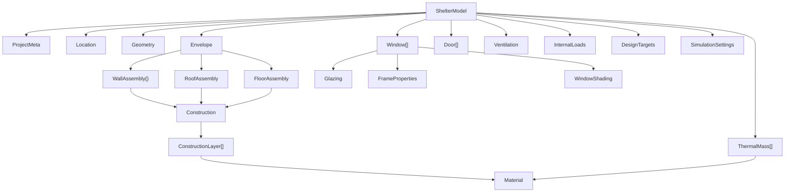

# ShelterModel — Canonical Domain Model

**SIH 2026 — Problem Statement 26051**  
**Single Source of Truth for All Shelter Data**

**Document Version:** 0.1  
**Schema Version:** 1.0.0  
**Date:** 2026-09-09  

---

## Design Principle

The entire platform operates on **ONE canonical `ShelterModel`**. This single data structure drives:

1. **3D Visualization** — The geometry engine reads dimensions, orientation, fenestration → generates vertices → Three.js renders them.
2. **Simulation Model Generation** — The IDF generator reads the entire model → produces EnergyPlus input.
3. **Database Persistence** — SQLAlchemy models map 1:1 to this schema → PostgreSQL stores it.
4. **API Transport** — Pydantic schemas serialize/deserialize this model to/from JSON.
5. **Comparison** — Two `ShelterModel` instances are compared field-by-field.
6. **Optimization** — The optimizer mutates specific fields, clones the model, and submits variants.
7. **Reports** — The report generator reads the model for the "Design Specification" section.

**There are NO parallel or shadow representations.** If something about a shelter is not in this model, it does not exist.

---

## Table of Contents

1. [Top-Level Structure](#1-top-level-structure)
2. [ProjectMeta](#2-projectmeta)
3. [Location](#3-location)
4. [Geometry](#4-geometry)
5. [Envelope](#5-envelope)
6. [Material](#6-material)
7. [Construction](#7-construction)
8. [Fenestration — Windows](#8-fenestration--windows)
9. [Fenestration — Doors](#9-fenestration--doors)
10. [ThermalMass](#10-thermalmass)
11. [Ventilation](#11-ventilation)
12. [InternalLoads](#12-internalloads)
13. [DesignTargets](#13-designtargets)
14. [SimulationSettings](#14-simulationsettings)
15. [Enum Definitions](#15-enum-definitions)
16. [Relationship Map](#16-relationship-map)
17. [Versioning and Migration](#17-versioning-and-migration)

---

## 1. Top-Level Structure

```
ShelterModel
├── schema_version: string               # "1.0.0"
├── project: ProjectMeta                  # Project metadata
├── location: Location                    # Geographic and climate data
├── geometry: Geometry                    # Shape, dimensions, orientation
├── envelope: Envelope                    # Walls, roof, floor constructions
│   ├── walls: dict[WallFace, WallAssembly]
│   ├── roof: RoofAssembly
│   └── floor: FloorAssembly
├── windows: list[Window]                 # All window openings
├── doors: list[Door]                     # All door openings
├── thermal_mass: list[ThermalMassElement] # Additional thermal mass elements
├── ventilation: Ventilation              # Infiltration + ventilation config
├── internal_loads: InternalLoads         # Occupancy, lighting, equipment
├── design_targets: DesignTargets         # Comfort and performance objectives
└── simulation_settings: SimulationSettings # Engine config, output requests
```

---

## 2. ProjectMeta

Metadata about the project and design. Not used in simulation — purely organizational.

```
ProjectMeta
├── id: UUID                              # REQUIRED. Server-generated.
├── name: string                          # REQUIRED. Max 255 chars.
├── description: string                   # OPTIONAL. Max 2000 chars.
├── tags: list[string]                    # OPTIONAL. User-defined tags. Max 20 tags, each max 50 chars.
├── version: integer                      # REQUIRED. Monotonic, starts at 1. Auto-incremented on mutation.
├── created_at: ISO 8601 datetime         # REQUIRED. Server-generated.
├── updated_at: ISO 8601 datetime         # REQUIRED. Server-generated.
└── created_by: UUID                      # REQUIRED. User ID. Server-generated.
```

| Field | Type | Required | Default | Validation |
|---|---|---|---|---|
| `id` | UUID v4 | Yes | auto | Valid UUID |
| `name` | string | Yes | — | 1–255 chars, non-empty after trim |
| `description` | string | No | `""` | 0–2000 chars |
| `tags` | string[] | No | `[]` | Max 20 items, each 1–50 chars |
| `version` | int | Yes | `1` | ≥ 1 |
| `created_at` | datetime | Yes | auto | ISO 8601 |
| `updated_at` | datetime | Yes | auto | ISO 8601 |
| `created_by` | UUID | Yes | auto | Valid user UUID |

---

## 3. Location

Geographic position and climate classification. Drives weather file selection and EnergyPlus `Site:Location`.

```
Location
├── latitude: float                       # REQUIRED. Decimal degrees. Range [-90, 90].
├── longitude: float                      # REQUIRED. Decimal degrees. Range [-180, 180].
├── elevation: float                      # REQUIRED. Meters above sea level. Range [-500, 9000].
├── timezone_utc_offset: float            # REQUIRED. Hours from UTC. Range [-12, 14]. E.g., 5.5 for IST.
├── city: string                          # OPTIONAL. Human-readable city name.
├── region: string                        # OPTIONAL. State/province/territory.
├── country: string                       # OPTIONAL. ISO 3166-1 alpha-2 code (e.g., "IN").
├── climate_zone: string                  # OPTIONAL. ASHRAE climate zone (e.g., "5B", "1A").
│                                         # Auto-populated from lat/lon if not provided.
├── koppen_class: string                  # OPTIONAL. Köppen-Geiger classification (e.g., "BWk").
└── weather_source: WeatherSource         # REQUIRED. How weather data is obtained.
    ├── type: WeatherSourceType           #   "epw_file" | "nasa_power" | "csv_upload" | "manual"
    ├── file_id: UUID                     #   Reference to stored weather file (for epw_file, csv_upload)
    ├── file_name: string                 #   Original filename
    ├── station_name: string              #   Weather station name (from EPW header)
    ├── station_wmo: string               #   WMO station number
    └── is_synthetic: boolean             #   true if generated from manual input or NASA POWER
```

| Field | Type | Required | Default | Validation |
|---|---|---|---|---|
| `latitude` | float | Yes | — | −90.0 ≤ v ≤ 90.0 |
| `longitude` | float | Yes | — | −180.0 ≤ v ≤ 180.0 |
| `elevation` | float | Yes | — | −500.0 ≤ v ≤ 9000.0 |
| `timezone_utc_offset` | float | Yes | — | −12.0 ≤ v ≤ 14.0, step 0.25 |
| `city` | string | No | `null` | Max 100 chars |
| `region` | string | No | `null` | Max 100 chars |
| `country` | string | No | `null` | 2-char ISO code |
| `climate_zone` | string | No | auto | Matches pattern `[1-8][A-C]?` |
| `koppen_class` | string | No | `null` | Max 5 chars |
| `weather_source.type` | enum | Yes | — | One of defined enum values |
| `weather_source.file_id` | UUID | Conditional | `null` | Required when type is `epw_file` or `csv_upload` |
| `weather_source.is_synthetic` | bool | Yes | `false` | — |

---

## 4. Geometry

Shape, dimensions, and orientation. This is what the geometry engine reads to produce 3D vertices.

```
Geometry
├── shape: ShapeType                      # REQUIRED. Enum.
├── dimensions: ShapeDimensions           # REQUIRED. Shape-specific parameters.
│   ├── length: float                     #   REQUIRED. Along X-axis (m). > 0.
│   ├── width: float                      #   REQUIRED. Along Y-axis (m). > 0.
│   ├── height: float                     #   REQUIRED. Wall height (m). > 0.
│   ├── length_wing: float                #   CONDITIONAL. L-shape wing length (m). Required if shape=l_shape.
│   ├── width_wing: float                 #   CONDITIONAL. L-shape wing width (m). Required if shape=l_shape.
│   └── height_wing: float                #   OPTIONAL. L-shape wing height. Default = height.
├── orientation_deg: float                # REQUIRED. Building azimuth (°). [0, 360).
├── roof: RoofGeometry                    # REQUIRED. Roof shape parameters.
│   ├── type: RoofType                    #   REQUIRED. Enum.
│   ├── slope_deg: float                  #   CONDITIONAL. Slope angle (°). Required if type ≠ flat.
│   ├── overhang_north: float             #   OPTIONAL. Overhang depth on north side (m). Default 0.
│   ├── overhang_south: float             #   OPTIONAL. Overhang depth on south side (m). Default 0.
│   ├── overhang_east: float              #   OPTIONAL. Overhang depth on east side (m). Default 0.
│   └── overhang_west: float              #   OPTIONAL. Overhang depth on west side (m). Default 0.
└── floor_elevation: float                # OPTIONAL. Floor above ground (m). Default 0. Range [0, 2].
```

| Field | Type | Required | Default | Validation |
|---|---|---|---|---|
| `shape` | enum | Yes | — | See ShapeType enum |
| `dimensions.length` | float | Yes | — | 1.0 ≤ v ≤ 50.0 m |
| `dimensions.width` | float | Yes | — | 1.0 ≤ v ≤ 50.0 m |
| `dimensions.height` | float | Yes | — | 1.5 ≤ v ≤ 10.0 m |
| `dimensions.length_wing` | float | Conditional | — | 1.0 ≤ v ≤ 50.0 m. Required if `shape = l_shape` |
| `dimensions.width_wing` | float | Conditional | — | 1.0 ≤ v ≤ 50.0 m. Required if `shape = l_shape` |
| `dimensions.height_wing` | float | No | `= height` | 1.5 ≤ v ≤ 10.0 m |
| `orientation_deg` | float | Yes | `0.0` | 0.0 ≤ v < 360.0 |
| `roof.type` | enum | Yes | `flat` | See RoofType enum |
| `roof.slope_deg` | float | Conditional | `0.0` | 0.0 ≤ v ≤ 60.0. Required and > 0 if type ≠ flat |
| `roof.overhang_*` | float | No | `0.0` | 0.0 ≤ v ≤ 3.0 m |
| `floor_elevation` | float | No | `0.0` | 0.0 ≤ v ≤ 2.0 m |

**Cross-field validation:**
- `dimensions.length × dimensions.width` ≥ 4.0 m² (minimum usable floor area)
- `dimensions.length × dimensions.width` ≤ 500.0 m² (reasonable shelter size)
- If `shape = l_shape`: `length_wing < length` and `width_wing < width`
- If `roof.type = gable` or `shed`: `roof.slope_deg` must be > 0

---

## 5. Envelope

The building envelope: walls, roof, and floor. Each is assigned a `Construction` (multi-layer material stack).

```
Envelope
├── walls: dict[WallFace, WallAssembly]   # REQUIRED. Keyed by wall face enum.
│   │                                     # Must contain all faces for the shape.
│   └── WallAssembly
│       ├── construction: Construction    #   REQUIRED. Multi-layer material stack.
│       └── surface_properties: SurfaceProperties  # OPTIONAL. Override absorptances.
│           ├── solar_absorptance: float  #   Range [0, 1]. Default from outermost material.
│           ├── thermal_absorptance: float #  Range [0, 1]. Default from outermost material.
│           └── visible_absorptance: float #  Range [0, 1]. Default from outermost material.
│
├── roof: RoofAssembly                    # REQUIRED.
│   ├── construction: Construction        #   REQUIRED.
│   └── surface_properties: SurfaceProperties  # OPTIONAL.
│
└── floor: FloorAssembly                  # REQUIRED.
    ├── construction: Construction        #   REQUIRED.
    ├── ground_contact: GroundContact     #   REQUIRED.
    │   ├── type: GroundContactType       #     "slab_on_grade" | "raised" | "basement"
    │   ├── soil_conductivity: float      #     W/(m·K). Default 1.0.
    │   └── ground_temperatures: float[12] #    Monthly ground temps (°C). 12 values.
    └── surface_properties: SurfaceProperties  # OPTIONAL.
```

**Wall face requirements by shape:**

| Shape | Required Wall Faces |
|---|---|
| `rectangular` | `north`, `south`, `east`, `west` |
| `l_shape` | `north`, `south`, `east`, `west`, `north_wing`, `east_wing` (or computed) |
| `quonset` | `north_end`, `south_end` (barrel walls are part of roof) |
| `a_frame` | `north_gable`, `south_gable` (side walls are part of roof) |

For the initial implementation, **`rectangular` is the primary shape** and requires exactly `{north, south, east, west}`.

---

## 6. Material

A single material layer with thermophysical properties.

```
Material
├── id: UUID                              # REQUIRED.
├── name: string                          # REQUIRED. Max 255 chars.
├── category: MaterialCategory            # REQUIRED. Enum.
├── conductivity: float                   # REQUIRED. W/(m·K). > 0.
├── density: float                        # REQUIRED. kg/m³. > 0.
├── specific_heat: float                  # REQUIRED. J/(kg·K). > 0.
├── roughness: Roughness                  # REQUIRED. Enum.
├── thermal_absorptance: float            # OPTIONAL. Default 0.9. Range [0, 1].
├── solar_absorptance: float              # OPTIONAL. Default 0.7. Range [0, 1].
├── visible_absorptance: float            # OPTIONAL. Default 0.7. Range [0, 1].
├── source: MaterialSource                # REQUIRED. Enum.
├── source_reference: string              # OPTIONAL. Citation (e.g., "ASHRAE HoF Table 4, Ch 26").
└── is_system: boolean                    # REQUIRED. true = pre-loaded, false = user-defined.
```

| Field | Type | Required | Default | Validation |
|---|---|---|---|---|
| `id` | UUID | Yes | auto | — |
| `name` | string | Yes | — | 1–255 chars |
| `category` | enum | Yes | — | See MaterialCategory |
| `conductivity` | float | Yes | — | 0.001 ≤ v ≤ 500.0 W/(m·K) |
| `density` | float | Yes | — | 1.0 ≤ v ≤ 25000.0 kg/m³ |
| `specific_heat` | float | Yes | — | 100.0 ≤ v ≤ 5000.0 J/(kg·K) |
| `roughness` | enum | Yes | `medium_rough` | See Roughness |
| `thermal_absorptance` | float | No | `0.9` | 0.0 ≤ v ≤ 1.0 |
| `solar_absorptance` | float | No | `0.7` | 0.0 ≤ v ≤ 1.0 |
| `visible_absorptance` | float | No | `0.7` | 0.0 ≤ v ≤ 1.0 |
| `source` | enum | Yes | — | See MaterialSource |
| `source_reference` | string | No | `null` | Max 500 chars |
| `is_system` | bool | Yes | `false` | — |

**Computed properties** (not stored, derived on access):
- `thermal_resistance(thickness)` = `thickness / conductivity` (m²·K/W)
- `thermal_mass(thickness)` = `density × specific_heat × thickness` (J/(m²·K))

---

## 7. Construction

A multi-layer assembly of materials with a defined thickness per layer.

```
Construction
├── id: UUID                              # REQUIRED.
├── name: string                          # REQUIRED. Max 255 chars.
├── layers: list[ConstructionLayer]       # REQUIRED. Min 1 layer, max 10 layers.
│   │                                     # Ordered OUTSIDE → INSIDE (index 0 = outermost).
│   └── ConstructionLayer
│       ├── material_id: UUID             #   REQUIRED. Reference to Material.
│       ├── material: Material            #   RESOLVED. The full material (populated by service layer).
│       └── thickness: float              #   REQUIRED. Meters. > 0.
└── surface_type: SurfaceType             # OPTIONAL. Hint: "wall" | "roof" | "floor". For validation.
```

| Field | Type | Required | Default | Validation |
|---|---|---|---|---|
| `id` | UUID | Yes | auto | — |
| `name` | string | Yes | — | 1–255 chars |
| `layers` | ConstructionLayer[] | Yes | — | 1 ≤ length ≤ 10 |
| `layers[].material_id` | UUID | Yes | — | Must reference valid Material |
| `layers[].thickness` | float | Yes | — | 0.001 ≤ v ≤ 2.0 m |
| `surface_type` | enum | No | `null` | "wall", "roof", "floor" |

**Computed properties:**
- `total_thickness` = Σ `layer.thickness` (m)
- `total_r_value` = Σ (`layer.thickness / layer.material.conductivity`) (m²·K/W)
  - Note: This is the material-only R-value. Film coefficients are added by EnergyPlus.
- `total_u_value` = `1.0 / total_r_value` (W/(m²·K))
  - Note: This is approximate. True U-value includes film resistances.

**Validation:**
- `total_thickness` ≤ 3.0 m (sanity check)
- `total_r_value` ≥ 0.01 m²·K/W (cannot have zero insulation — even glass has some R)

---

## 8. Fenestration — Windows

Each window is placed on a specific wall face at a specific position.

```
Window
├── id: UUID                              # REQUIRED. Client-generated for immediate 3D preview.
├── name: string                          # OPTIONAL. E.g., "South Window 1".
├── wall_face: WallFace                   # REQUIRED. Which wall this window is on.
├── position: WindowPosition              # REQUIRED. Location on the wall.
│   ├── offset_x: float                  #   REQUIRED. Distance from left edge of wall (m). ≥ 0.
│   └── sill_height: float               #   REQUIRED. Distance from floor to bottom of window (m). ≥ 0.
├── width: float                          # REQUIRED. Window width (m). > 0.
├── height: float                         # REQUIRED. Window height (m). > 0.
├── glazing: Glazing                      # REQUIRED. Glass properties.
│   ├── type: GlazingType                #   REQUIRED. Enum.
│   ├── u_value: float                   #   REQUIRED. W/(m²·K). Center-of-glass U-value.
│   ├── shgc: float                      #   REQUIRED. Solar Heat Gain Coefficient [0, 1].
│   └── visible_transmittance: float     #   REQUIRED. [0, 1].
├── frame: FrameProperties                # OPTIONAL. Frame details.
│   ├── type: FrameType                  #   OPTIONAL. Enum.
│   ├── width: float                     #   OPTIONAL. Frame width (m). Default 0.05.
│   └── u_value: float                   #   OPTIONAL. Frame U-value W/(m²·K).
├── shading: WindowShading                # OPTIONAL. External shading devices.
│   ├── type: ShadingType                #   OPTIONAL. Enum.
│   ├── depth: float                     #   OPTIONAL. Projection depth (m).
│   ├── top_offset: float               #   OPTIONAL. Distance above window top (m).
│   └── transmittance: float            #   OPTIONAL. Solar transmittance of shading device [0, 1].
└── schedule: OperationSchedule           # OPTIONAL. Opening schedule (for operable windows).
    ├── type: ScheduleType               #   "always_closed" | "always_open" | "daytime" | "custom"
    └── hourly_fractions: float[24]      #   24 hourly values [0, 1]. Used when type = custom.
```

| Field | Type | Required | Default | Validation |
|---|---|---|---|---|
| `id` | UUID | Yes | — | — |
| `name` | string | No | auto-generated | Max 255 chars |
| `wall_face` | enum | Yes | — | Must be valid for the shelter shape |
| `position.offset_x` | float | Yes | — | ≥ 0 |
| `position.sill_height` | float | Yes | — | ≥ 0 |
| `width` | float | Yes | — | 0.2 ≤ v ≤ 10.0 m |
| `height` | float | Yes | — | 0.2 ≤ v ≤ 5.0 m |
| `glazing.type` | enum | Yes | — | See GlazingType |
| `glazing.u_value` | float | Yes | — | 0.5 ≤ v ≤ 7.0 W/(m²·K) |
| `glazing.shgc` | float | Yes | — | 0.0 ≤ v ≤ 1.0 |
| `glazing.visible_transmittance` | float | Yes | — | 0.0 ≤ v ≤ 1.0 |
| `frame.width` | float | No | `0.05` | 0.01 ≤ v ≤ 0.2 m |
| `shading.depth` | float | No | `0.0` | 0.0 ≤ v ≤ 3.0 m |
| `schedule.type` | enum | No | `always_closed` | — |

**Cross-field validation:**
- `position.offset_x + width` ≤ wall length (window must fit within wall)
- `position.sill_height + height` ≤ wall height (window must fit within wall)
- `position.offset_x` ≥ 0.05 (minimum edge clearance)
- No two windows on the same wall may overlap (check bounding rectangles)
- Total window area on any wall ≤ 80% of wall gross area (EnergyPlus practical limit)

---

## 9. Fenestration — Doors

Each door is placed on a specific wall face.

```
Door
├── id: UUID                              # REQUIRED.
├── name: string                          # OPTIONAL. E.g., "Main Entry".
├── wall_face: WallFace                   # REQUIRED. Which wall this door is on.
├── position: DoorPosition                # REQUIRED. Location on the wall.
│   ├── offset_x: float                  #   REQUIRED. Distance from left edge of wall (m). ≥ 0.
│   └── offset_z: float                  #   OPTIONAL. Distance from floor (m). Default 0.
├── width: float                          # REQUIRED. Door width (m). > 0.
├── height: float                         # REQUIRED. Door height (m). > 0.
├── construction: DoorConstruction        # REQUIRED.
│   ├── type: DoorType                   #   REQUIRED. Enum.
│   ├── u_value: float                   #   REQUIRED. W/(m²·K).
│   ├── has_glazing: boolean             #   OPTIONAL. Default false.
│   ├── glazing_fraction: float          #   CONDITIONAL. Fraction of door area that is glazed. [0, 1].
│   └── glazing_shgc: float             #   CONDITIONAL. SHGC of glazed portion. [0, 1].
└── schedule: OperationSchedule           # OPTIONAL. Opening schedule.
    ├── type: ScheduleType               #   "always_closed" | "always_open" | "daytime" | "custom"
    └── hourly_fractions: float[24]      #   24 hourly values [0, 1].
```

| Field | Type | Required | Default | Validation |
|---|---|---|---|---|
| `id` | UUID | Yes | — | — |
| `name` | string | No | auto | Max 255 chars |
| `wall_face` | enum | Yes | — | Valid for shape |
| `position.offset_x` | float | Yes | — | ≥ 0 |
| `position.offset_z` | float | No | `0.0` | ≥ 0 |
| `width` | float | Yes | — | 0.5 ≤ v ≤ 3.0 m |
| `height` | float | Yes | — | 1.5 ≤ v ≤ 3.0 m |
| `construction.type` | enum | Yes | — | See DoorType |
| `construction.u_value` | float | Yes | — | 0.5 ≤ v ≤ 7.0 W/(m²·K) |
| `construction.has_glazing` | bool | No | `false` | — |
| `construction.glazing_fraction` | float | Conditional | `0.0` | 0.0 ≤ v ≤ 0.8. Required if `has_glazing = true` |
| `construction.glazing_shgc` | float | Conditional | — | 0.0 ≤ v ≤ 1.0. Required if `has_glazing = true` |

**Cross-field validation:**
- Same wall-fit rules as windows
- No overlap with any window or other door on the same wall
- At least 1 door in the entire shelter (warning, not error — user might be modeling a sealed test cell)

---

## 10. ThermalMass

Additional thermal mass elements beyond the wall/floor/roof mass. Examples: internal masonry walls, water walls, phase-change material panels.

```
ThermalMassElement
├── id: UUID                              # REQUIRED.
├── name: string                          # OPTIONAL. E.g., "Internal Water Wall".
├── material: ThermalMassMaterial         # REQUIRED.
│   ├── type: ThermalMassType            #   REQUIRED. Enum.
│   ├── material_id: UUID                #   CONDITIONAL. Reference to Material in library.
│   ├── conductivity: float              #   CONDITIONAL. Override if no material_id.
│   ├── density: float                   #   CONDITIONAL. Override if no material_id.
│   └── specific_heat: float             #   CONDITIONAL. Override if no material_id.
├── geometry: ThermalMassGeometry         # REQUIRED.
│   ├── shape: ThermalMassShape          #   "wall" | "cylinder" | "block"
│   ├── width: float                     #   Width or diameter (m).
│   ├── height: float                    #   Height (m).
│   └── depth: float                     #   Depth/thickness (m).
├── location: ThermalMassLocation         # REQUIRED.
│   ├── placement: ThermalMassPlacement  #   "interior_freestanding" | "against_north_wall" | "against_south_wall" | etc.
│   └── offset_from_wall: float          #   Distance from wall if freestanding (m).
├── thickness: float                      # REQUIRED. Effective thickness for thermal calculation (m).
└── exposed_area: float                   # REQUIRED. Area exposed to zone air (m²).
```

| Field | Type | Required | Default | Validation |
|---|---|---|---|---|
| `material.type` | enum | Yes | — | See ThermalMassType |
| `material.material_id` | UUID | Conditional | `null` | Required if `type` is not `water` or `pcm` |
| `thickness` | float | Yes | — | 0.01 ≤ v ≤ 2.0 m |
| `exposed_area` | float | Yes | — | 0.1 ≤ v ≤ 200.0 m² |

**Note:** Thermal mass elements are modeled in EnergyPlus as `InternalMass` objects. They participate in the zone heat balance (radiant and convective exchange) but do NOT have a 3D geometric representation in the EnergyPlus surface model. In the 3D viewer, they can be shown as semi-transparent overlays at their placement location.

---

## 11. Ventilation

Infiltration (uncontrolled air leakage) and ventilation (controlled air exchange).

```
Ventilation
├── infiltration: Infiltration            # REQUIRED.
│   ├── method: InfiltrationMethod       #   REQUIRED. Enum.
│   ├── rate_ach: float                  #   CONDITIONAL. Air changes per hour. Used when method = "ach".
│   ├── rate_m3s: float                  #   CONDITIONAL. m³/s. Used when method = "flow_rate".
│   ├── rate_m3s_per_m2: float           #   CONDITIONAL. m³/s per m² floor area. Used when method = "flow_per_area".
│   ├── construction_quality: ConstructionQuality  # OPTIONAL. Enum. Used to auto-calculate if no rate given.
│   ├── coefficients: InfiltrationCoeffs #   OPTIONAL. Wind/stack coefficients for EnergyPlus.
│   │   ├── constant: float             #     Default 1.0 (fraction of design rate always present).
│   │   ├── temperature: float           #     Coefficient for |T_zone - T_outdoor|. Default 0.0.
│   │   ├── wind_speed: float            #     Coefficient for wind speed. Default 0.0.
│   │   └── wind_speed_sq: float         #     Coefficient for wind speed². Default 0.0.
│   └── schedule: OperationSchedule      #   OPTIONAL. Default always-on.
│
├── natural_ventilation: NaturalVentilation  # OPTIONAL.
│   ├── enabled: boolean                 #   REQUIRED. Default false.
│   ├── strategy: NatVentStrategy        #   CONDITIONAL. Enum.
│   ├── min_outdoor_temp: float          #   OPTIONAL. Minimum outdoor temp to allow ventilation (°C).
│   ├── max_outdoor_temp: float          #   OPTIONAL. Maximum outdoor temp (°C).
│   ├── min_indoor_temp: float           #   OPTIONAL. Minimum indoor temp to trigger ventilation (°C).
│   ├── effective_area: float            #   OPTIONAL. Total effective opening area (m²).
│   └── schedule: OperationSchedule      #   OPTIONAL.
│
└── mechanical_ventilation: MechVentilation  # OPTIONAL.
    ├── enabled: boolean                 #   REQUIRED. Default false.
    ├── flow_rate: float                 #   CONDITIONAL. m³/s. Required if enabled.
    ├── heat_recovery: boolean           #   OPTIONAL. Default false.
    ├── heat_recovery_efficiency: float  #   CONDITIONAL. [0, 1]. Required if heat_recovery = true.
    └── schedule: OperationSchedule      #   OPTIONAL.
```

| Field | Type | Required | Default | Validation |
|---|---|---|---|---|
| `infiltration.method` | enum | Yes | `ach` | See InfiltrationMethod |
| `infiltration.rate_ach` | float | Conditional | — | 0.0 ≤ v ≤ 10.0 ACH |
| `infiltration.construction_quality` | enum | No | `average` | See ConstructionQuality |
| `natural_ventilation.enabled` | bool | No | `false` | — |
| `natural_ventilation.min_outdoor_temp` | float | No | `15.0` | −50 ≤ v ≤ 50 °C |
| `natural_ventilation.max_outdoor_temp` | float | No | `35.0` | −50 ≤ v ≤ 50 °C |
| `mechanical_ventilation.enabled` | bool | No | `false` | — |
| `mechanical_ventilation.flow_rate` | float | Conditional | — | 0.0 ≤ v ≤ 10.0 m³/s |
| `mechanical_ventilation.heat_recovery_efficiency` | float | Conditional | — | 0.0 ≤ v ≤ 0.95 |

---

## 12. InternalLoads

Heat generated inside the shelter by occupants, lighting, and equipment.

```
InternalLoads
├── occupancy: Occupancy                  # REQUIRED.
│   ├── num_people: integer              #   REQUIRED. ≥ 0.
│   ├── activity_level: ActivityLevel    #   REQUIRED. Enum.
│   ├── metabolic_rate_met: float        #   OPTIONAL. Override (met). Auto-set from activity_level.
│   ├── clothing_insulation_clo: float   #   OPTIONAL. Override (clo).
│   ├── work_efficiency: float           #   OPTIONAL. [0, 1]. Default 0.0 (all metabolic heat → zone).
│   └── schedule: OperationSchedule      #   OPTIONAL. Default always-occupied.
│
├── lighting: Lighting                    # OPTIONAL.
│   ├── enabled: boolean                 #   REQUIRED. Default false.
│   ├── power_density: float             #   CONDITIONAL. W/m² (floor area). Required if enabled.
│   ├── fraction_radiant: float          #   OPTIONAL. Default 0.7.
│   └── schedule: OperationSchedule      #   OPTIONAL.
│
└── equipment: Equipment                  # OPTIONAL.
    ├── enabled: boolean                 #   REQUIRED. Default false.
    ├── power: float                     #   CONDITIONAL. Total equipment power (W). Required if enabled.
    ├── fraction_radiant: float          #   OPTIONAL. Default 0.3.
    ├── fraction_latent: float           #   OPTIONAL. Default 0.0.
    └── schedule: OperationSchedule      #   OPTIONAL.
```

| Field | Type | Required | Default | Validation |
|---|---|---|---|---|
| `occupancy.num_people` | int | Yes | — | 0 ≤ v ≤ 100 |
| `occupancy.activity_level` | enum | Yes | `seated_relaxed` | See ActivityLevel |
| `occupancy.metabolic_rate_met` | float | No | from enum | 0.7 ≤ v ≤ 4.0 met |
| `occupancy.clothing_insulation_clo` | float | No | `1.0` | 0.0 ≤ v ≤ 3.0 clo |
| `lighting.power_density` | float | Conditional | — | 0.0 ≤ v ≤ 50.0 W/m² |
| `equipment.power` | float | Conditional | — | 0.0 ≤ v ≤ 10000.0 W |

---

## 13. DesignTargets

User-specified performance objectives. Used by the comfort analysis, comparison engine, and optimizer.

```
DesignTargets
├── comfort: ComfortTargets               # REQUIRED.
│   ├── model: ComfortModel              #   REQUIRED. Enum.
│   ├── target_indoor_temp_min: float    #   REQUIRED. Lower comfort bound (°C).
│   ├── target_indoor_temp_max: float    #   REQUIRED. Upper comfort bound (°C).
│   ├── acceptable_ppd_max: float        #   OPTIONAL. Max PPD (%). Default 20. PMV model only.
│   └── adaptive_category: AdaptiveCategory  # OPTIONAL. EN 16798 category. Default II.
│
├── energy: EnergyTargets                 # OPTIONAL.
│   ├── max_heating_demand: float        #   OPTIONAL. kWh/(m²·a). Target upper limit.
│   ├── max_heat_loss_coefficient: float #   OPTIONAL. W/K. Overall UA target.
│   └── min_solar_utilization: float     #   OPTIONAL. Fraction [0, 1]. Min useful solar gain / total solar available.
│
└── priority: ObjectivePriority           # OPTIONAL.
    ├── primary: ObjectiveType           #   "comfort_hours" | "heating_demand" | "heat_loss"
    └── secondary: ObjectiveType         #   Optional secondary objective.
```

| Field | Type | Required | Default | Validation |
|---|---|---|---|---|
| `comfort.model` | enum | Yes | `adaptive` | See ComfortModel |
| `comfort.target_indoor_temp_min` | float | Yes | `18.0` | 10.0 ≤ v ≤ 30.0 °C |
| `comfort.target_indoor_temp_max` | float | Yes | `26.0` | 15.0 ≤ v ≤ 40.0 °C |
| `comfort.acceptable_ppd_max` | float | No | `20.0` | 5.0 ≤ v ≤ 50.0 % |
| `comfort.adaptive_category` | enum | No | `category_ii` | I, II, III |
| `energy.max_heating_demand` | float | No | `null` | 0.0 ≤ v ≤ 500.0 kWh/(m²·a) |

**Cross-field validation:**
- `target_indoor_temp_min` < `target_indoor_temp_max`
- `target_indoor_temp_max − target_indoor_temp_min` ≥ 2.0 (minimum comfort band width)

---

## 14. SimulationSettings

Configuration for the simulation engine. Not part of the physical shelter — controls how the simulation is run.

```
SimulationSettings
├── engine: SimulationEngine              # REQUIRED.
│   ├── type: EngineType                 #   REQUIRED. Enum.
│   └── version: string                  #   OPTIONAL. E.g., "24.2.0". Auto-detected from install.
│
├── weather: WeatherConfig                # REQUIRED.
│   ├── file_id: UUID                    #   REQUIRED. Reference to stored weather file.
│   └── file_name: string               #   OPTIONAL. Display name.
│
├── run_period: RunPeriod                 # REQUIRED.
│   ├── start_month: integer             #   REQUIRED. 1–12.
│   ├── start_day: integer               #   REQUIRED. 1–31.
│   ├── end_month: integer               #   REQUIRED. 1–12.
│   ├── end_day: integer                 #   REQUIRED. 1–31.
│   └── num_warmup_days: integer         #   OPTIONAL. Default 25 (EnergyPlus default).
│
├── timestep: integer                     # REQUIRED. Timesteps per hour. Default 6.
│
├── output_variables: list[OutputVariable]  # REQUIRED. What to report.
│   └── OutputVariable
│       ├── name: string                 #   EnergyPlus output variable name.
│       ├── key: string                  #   EnergyPlus key (e.g., "*" for all zones, or specific zone name).
│       └── frequency: OutputFrequency   #   "timestep" | "hourly" | "daily" | "monthly" | "annual"
│
├── solar_distribution: SolarDistribution # OPTIONAL. Default "full_interior_and_exterior".
├── convection_algorithm_inside: string   # OPTIONAL. Default "TARP".
├── convection_algorithm_outside: string  # OPTIONAL. Default "DOE-2".
└── ground_model: GroundModelType         # OPTIONAL. "monthly_averages" | "kiva". Default "monthly_averages".
```

| Field | Type | Required | Default | Validation |
|---|---|---|---|---|
| `engine.type` | enum | Yes | `energyplus` | See EngineType |
| `weather.file_id` | UUID | Yes | — | Must reference existing weather file |
| `run_period.start_month` | int | Yes | `1` | 1–12 |
| `run_period.start_day` | int | Yes | `1` | 1–31 |
| `run_period.end_month` | int | Yes | `12` | 1–12 |
| `run_period.end_day` | int | Yes | `31` | 1–31 |
| `timestep` | int | Yes | `6` | Must be 1, 2, 3, 4, 5, 6, 10, 12, 15, 20, 30, or 60 |

---

## 15. Enum Definitions

### ShapeType
```
rectangular        # 4 walls, flat/gable/shed roof
l_shape            # L-shaped floor plan
quonset            # Barrel/Quonset hut (curved roof approximated as facets)
a_frame            # A-frame with steep roof doubling as walls
```

### RoofType
```
flat               # Flat roof (0° slope)
gable              # Symmetric gable (ridge along length axis)
shed               # Single-slope (high side = north for solar, in NH)
hip                # Hipped roof (4 sloping planes) — future
barrel             # Barrel vault (Quonset) — approximated as N flat facets
```

### WallFace
```
north              # North face (at 0° orientation)
south              # South face
east               # East face
west               # West face
north_wing         # L-shape: wing north face
east_wing          # L-shape: wing east face
north_end          # Quonset: north end wall
south_end          # Quonset: south end wall
north_gable        # A-frame: north gable wall
south_gable        # A-frame: south gable wall
```

### MaterialCategory
```
masonry            # Brick, stone, concrete, rammed earth, mud-brick
insulation         # EPS, XPS, mineral wool, aerogel, polyurethane foam
timber             # Wood, plywood, bamboo
metal              # Steel, aluminum
plaster            # Cement plaster, mud plaster, lime plaster
membrane           # Vapor barriers, waterproofing membranes
glazing            # Glass (for window constructions only)
pcm                # Phase-change materials
composite          # GFRP panels, sandwich panels
soil               # Earth, gravel (for ground models)
```

### MaterialSource
```
ashrae             # ASHRAE Handbook of Fundamentals
bis                # Bureau of Indian Standards
cibse              # CIBSE Guide A
iso                # ISO standards
manufacturer       # Manufacturer datasheet
research_paper     # Published research
user_defined       # User-entered (no citation)
```

### Roughness
```
very_rough         # Stucco, rough plaster
rough              # Brick, rough wood
medium_rough       # Concrete, unfinished wood
medium_smooth      # Clear pine, smooth plaster
smooth             # Glass, smooth metal
very_smooth        # Polished metal
```

### GlazingType
```
single_clear       # Single pane clear glass
single_tinted      # Single pane tinted
double_clear       # Double pane clear (air-filled)
double_low_e       # Double pane low-emissivity
double_argon_low_e # Double pane low-e argon-filled
triple_clear       # Triple pane clear
triple_low_e       # Triple pane low-e
```

### FrameType
```
wood               # Wooden frame
aluminum           # Aluminum (high conductivity)
aluminum_break     # Aluminum with thermal break
upvc               # uPVC (low conductivity)
fiberglass         # Fiberglass composite
```

### ShadingType
```
none               # No shading
overhang           # Horizontal overhang above window
fin_left           # Vertical fin on left side
fin_right          # Vertical fin on right side
fin_both           # Vertical fins on both sides
louver             # Horizontal louver/blind
```

### DoorType
```
solid_wood         # Solid wood door
solid_metal        # Metal door
insulated_metal    # Insulated metal door (sandwich panel)
glazed_wood        # Wood door with glass panel
glazed_metal       # Metal door with glass panel
```

### GroundContactType
```
slab_on_grade      # Floor slab directly on ground
raised             # Raised floor with air gap beneath
basement           # Below-grade basement walls + floor
```

### InfiltrationMethod
```
ach                # Specify as air changes per hour
flow_rate          # Specify as absolute flow rate (m³/s)
flow_per_area      # Specify as flow per unit floor area (m³/s/m²)
quality_based      # Auto-calculate from construction quality enum
```

### ConstructionQuality
```
very_tight         # 0.1 ACH — new construction, sealed envelope
tight              # 0.3 ACH — good construction, weather-stripped
average            # 0.5 ACH — typical construction
leaky              # 1.0 ACH — older construction, poor sealing
very_leaky         # 2.0 ACH — makeshift/temporary construction
```

### NatVentStrategy
```
cross_ventilation  # Openings on opposite walls
single_sided       # Openings on one wall only
stack_effect       # High/low openings using buoyancy
```

### ActivityLevel
```
sleeping           # 0.7 met
seated_relaxed     # 1.0 met
seated_working     # 1.2 met
standing_relaxed   # 1.2 met
standing_light     # 1.6 met
walking_slow       # 2.0 met
walking_fast       # 3.0 met
heavy_work         # 3.0–4.0 met
```

### ComfortModel
```
pmv_ppd            # Fanger PMV/PPD model (ASHRAE 55, ISO 7730)
adaptive           # Adaptive Comfort (EN 16798-1)
both               # Compute both, report both
```

### AdaptiveCategory (EN 16798-1)
```
category_i         # ±2°C from optimal — high expectation
category_ii        # ±3°C from optimal — normal expectation (default)
category_iii       # ±4°C from optimal — acceptable
```

### EngineType
```
energyplus         # Direct EnergyPlus execution
openstudio         # OpenStudio SDK → EnergyPlus
ansys              # ANSYS Fluent/Mechanical (optional, licensed)
```

### OutputFrequency
```
timestep           # Every simulation timestep
hourly             # Every hour
daily              # Daily aggregation
monthly            # Monthly aggregation
annual             # Annual total
```

### SolarDistribution
```
minimal_shadowing                  # No interior solar distribution
full_exterior                      # Exterior shading only
full_interior_and_exterior         # Full solar tracking (recommended)
full_interior_and_exterior_with_reflections  # Most accurate, slower
```

### ThermalMassType
```
masonry_wall       # Internal brick/stone/concrete wall
water_wall         # Water-filled containers
pcm_panel          # Phase-change material panel
concrete_slab      # Interior concrete mass
stone_mass         # Interior stone mass
```

### ThermalMassPlacement
```
interior_freestanding              # Freestanding in zone
against_north_wall
against_south_wall
against_east_wall
against_west_wall
center             # Center of zone
```

### WeatherSourceType
```
epw_file           # Standard EPW file from recognized source
nasa_power         # Fetched from NASA POWER API
csv_upload         # User-uploaded CSV
manual             # Monthly averages entered manually
```

### ScheduleType
```
always_closed      # Fraction = 0.0 at all hours
always_open        # Fraction = 1.0 at all hours
daytime            # Fraction = 1.0 from 07:00–19:00, 0.0 otherwise
nighttime          # Fraction = 1.0 from 19:00–07:00, 0.0 otherwise
custom             # User-defined 24-hour profile
```

### ObjectiveType
```
comfort_hours      # Maximize % of hours within comfort range
heating_demand     # Minimize annual heating energy demand
heat_loss          # Minimize total envelope heat loss
solar_utilization  # Maximize useful solar gain
```

---

## 16. Relationship Map



---

## 17. Versioning and Migration

### Schema Version History

| Version | Date | Changes |
|---|---|---|
| `1.0.0` | 2026-09-09 | Initial schema — rectangular shelters, basic fenestration, EnergyPlus engine |

### Migration Rules

When loading a `ShelterModel` from storage:
1. Read `schema_version` field.
2. If version < current, apply migration functions sequentially.
3. Migration functions add new fields with defaults; they never remove fields.
4. After migration, write back with updated `schema_version`.

### Forward Compatibility

Unknown fields in JSON are **silently ignored** (not rejected). This allows newer clients to send data to older backends without breaking.

### Backward Compatibility

New optional fields always have documented default values. A model saved by v1.0.0 loads correctly in v1.1.0 with defaults applied for new fields.

---

*This document defines the canonical data model. See [INPUT_SPECIFICATION.md](file:///c:/CODINGG/HACKATHON/SIH%202026/docs/INPUT_SPECIFICATION.md) for complete validation rules and [UNITS_AND_CONVENTIONS.md](file:///c:/CODINGG/HACKATHON/SIH%202026/docs/UNITS_AND_CONVENTIONS.md) for unit and coordinate definitions.*
